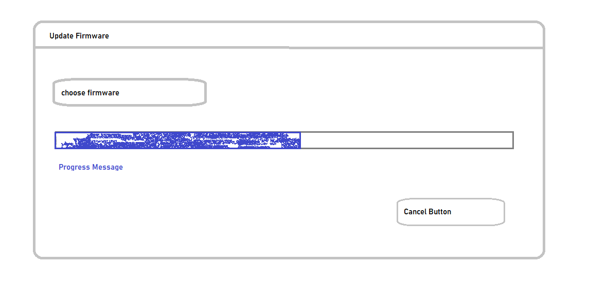

["poka yoke"](https://kanbanize.com/lean-management/improvement/what-is-poka-yoke) is a japanese word ポカヨケ, which mean Fool-proofing. I first meet this word in a book talking about User interface design in web serval years ago. But soon I soon found where it should be applied.

My boss in Emerson assignd me to write a update firmware page in site supervisor. This is a simple page like below.

<figure class="image">
  
</figure>

The user first choose a firmware file by click choose fireware button. It tigger a file chooser popup by OS. Then it start to upload file to backend server. After server received the whole file, CRC and file version should be checked first. Then the normal update progress finally start, including boot loader, the os image write to some memory etc.

The firmware is about 64MB big. Its name is like XXXX.Pkg. But that maybe wrong by renaming file evilly. Uploading that to server take a while. Then your user can know whether the file is right by server notification. Server know it because it has a 100 line C function from the header part of the firmware.

Waiting for message from backend server is time consuming. At that time, web browser provide some juicy new function called [File Reader](https://developer.mozilla.org/en-US/docs/Web/API/FileReader) and [ArrayBuffer](https://developer.mozilla.org/en-US/docs/Web/JavaScript/Reference/Global_Objects/ArrayBuffer). It can do c function part in browser side once after user select file from OS side. User can know firmware version immedately. That is cool.

One may ask what about the user which do not have such browser. The answser is simple. They will do the old way. Server will tell whether firmware is good. Different browser have different behaivor based on ability.

A little bad thing i found in above approach was when read the large file is taking some time for browser calculation. So there ware a short freeze in browser. The undesirable effect soon be eliminated by introduce [web worker](https://developer.mozilla.org/en-US/docs/Web/API/Web_Workers_API/Using_web_workers). Now the browser will have async read and analysis file. The main thread just send file content and wait for json result from web worker. 

The final work is in "4.12.1 Firmware Update - Remote Access" of [site supervisor user guide](https://climate.emerson.com/documents/site-supervisor-user-guide-rev-17-en-us-6471528.pdf).

Have some tea.

